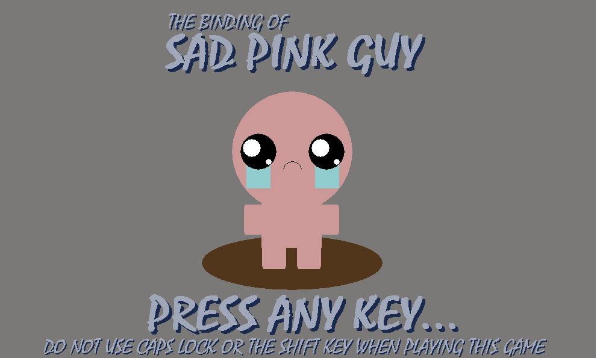

# The-Binding-of-Sad-Pink-Guy
**High School Computer Science Project**

Binding of Isaac knockoff completed in a group of 3
___
In this game, the player's(or user's) objective is to escape this maze-oriented map.

There are many puzzles and other "mini-games" that seperates this game from other maze-like games.

The player must combine both strategy and logic to overcome these puzzles so that they may advance, but player must also be wary of tricks and traps that would hinder their progress.
___

